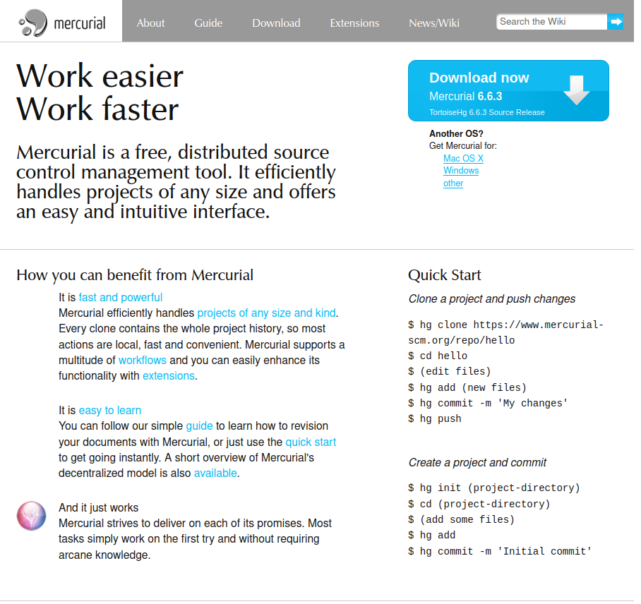
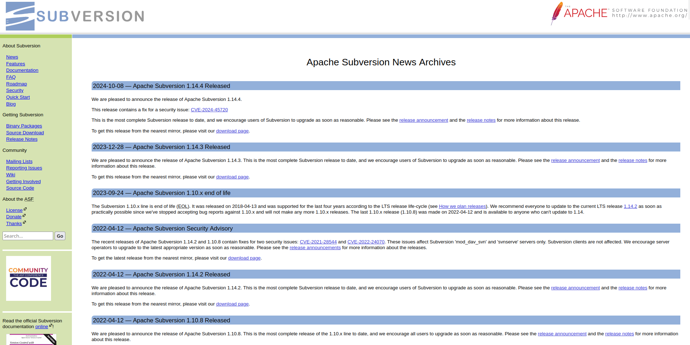
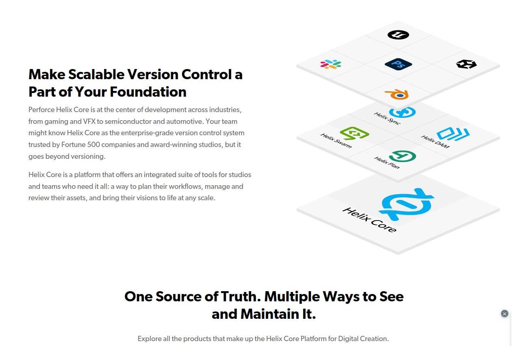
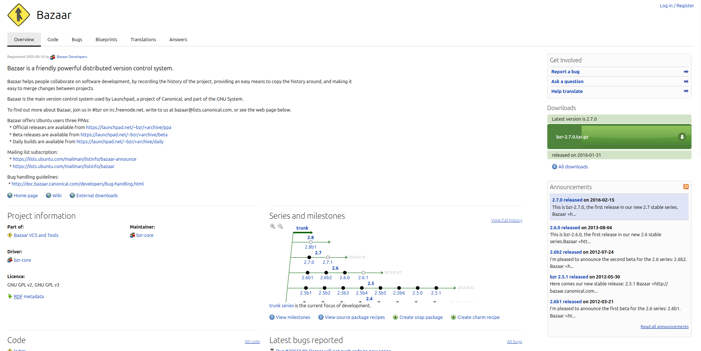

# Git vs Other VCS: A comparative Analysis
Version control systems (VCS) are essential tools for managing projects, enabling efficient collaboration and teamwork in modern software development. Among them, Git stands out as the most widely adopted, especially for open-source and collaborative projects, thanks to its flexibility and powerful features.

## Alternative Version Control Systems

### 1. Mercurial
Mercurial is a distributed version control system designed for efficiency, speed, and simplicity. It supports branching, merging, and collaborative development workflows similar to Git. Mercurial is suitable for both small and large projects, offering a decentralized structure that allows developers to work offline and synchronize with the central repository when needed. Its straightforward command syntax and extensibility make it accessible to both beginners and advanced users.

`Figure 1. Mercurial diagram`
### 2. SVN (Subversion)
SVN, or Subversion, is an open-source, centralized version control system that tracks changes to files and directories, providing a single central repository for collaboration. It supports key features such as branching, merging, commits, and access control for multiple users. SVN is often used for legacy systems or projects where maintaining a central version history is crucial. It integrates with other tools like Apache and IDEs for a streamlined workflow, making it suitable for teams that prefer a more structured and centralized approach.

`Figure 1. Subversion diagram`
### 3. Perforce (Helix Core)
Perforce, also known as Helix Core, is a centralized version control system developed by Perforce Software Inc. It’s designed for handling large codebases and complex projects, especially in industries like game development, automotive, and financial services. Perforce offers robust features such as high performance, workspace management, file locking, and advanced code review systems, ensuring efficient collaboration for distributed teams. Its ability to manage binary files alongside code and support for integrations with popular CI/CD tools make it a strong choice for enterprise-level projects.

`Figure 1. Perforce diagram`

### 4. Bazaar
Bazaar is a distributed version control system known for its user-friendly interface and adaptability to various workflows. It allows developers to work independently and merge changes efficiently, making it ideal for both open-source projects and commercial development. Bazaar supports decentralized collaboration, meaning each developer has a full copy of the repository’s history and can work offline. It also integrates well with other VCS systems like Git and SVN, providing flexibility for teams working with multiple version control solutions.

`Figure 1. Bazaar diagram`

 
While Git is the most popular version control systems, it might not meet the needs for every developer or project.

## Exploring Git

Git is a distributed version control system developed by **Linus Torvalds** in 2005. Unlike centralized systems, Git’s distributed nature allows each working directory to function as a fully independent repository with complete version history and tracking capabilities. This decentralization enables developers to work offline, commit changes, and manage branches locally without relying on internet connectivity, ensuring flexibility and efficiency.

One of Git’s standout features is its remarkable speed, making it a preferred choice for projects of all sizes and complexities. Its versatility and robust branching and merging capabilities also make it ideal for both individual developers and large collaborative teams.of its widespread adoption from small personal endeavors to massive collaborative initiatives.

## Comparing Version Control Systems

While Git is a powerful version control system, it isn’t the only option available. A comparison highlighting unique features and advantages of Git compared to other systems:

### 1. Speed and Performance
Git’s distributed model allows for fast operations, even with large codebases, as most actions are performed locally. In contrast, centralized version control systems (e.g., SVN, Perforce) often experience slower performance due to the need to communicate with a central server, which can introduce latency and performance bottlenecks.

### 2. Security and Data Integrity
Git enhances security by using cryptographic hashing for commits, ensuring the integrity of the commit history and making it difficult for unauthorized changes to go unnoticed. Centralized systems, on the other hand, rely more on server-based access controls and may require additional security measures to protect the central repository, making them potentially more vulnerable if not properly configured.

### 3. Flexibility
Git’s distributed approach offers high flexibility, enabling developers to choose workflows that best suit their needs, whether it’s feature branching, trunk-based development, or others. Centralized systems often have more rigid structures and less flexibility, requiring extensive configuration and adaptation to achieve similar levels of workflow customization.

### 4. Offline Capabilities
Git allows developers to work offline, enabling them to commit, branch, and merge changes without requiring a network connection. This is not possible with centralized systems, as they depend on the availability of the central server for most operations. This offline functionality gives Git a significant advantage for remote work and distributed teams.

### 5. Collaboration and Merging
Git’s advanced branching and merging features make it easier for teams to collaborate on large projects. Developers can create and manage multiple branches independently, then merge them without affecting the main codebase. Centralized systems often lack such advanced branching features, making collaboration and merging more cumbersome, especially in large or complex projects.

## Application and adoption in various industries.

Git has become the go-to version control system in a wide range of industries due to its flexibility, speed, and robust feature set. Its distributed nature and ability to manage large codebases make it suitable for both small and large-scale projects. 
### 1. **Software Development and IT Services**
   - **Application:** Git is a cornerstone in software development, used for version control, collaboration, and continuous integration (CI) and continuous delivery (CD) pipelines. It allows teams to manage code versions, track changes, and work simultaneously on different features without conflicts.
   - **Adoption:** Nearly all software companies, from startups to tech giants like Microsoft, Google, and IBM, use Git as their primary version control tool. GitHub, GitLab, and Bitbucket are popular platforms integrating Git for collaboration, code review, and project management.

### 2. **Open Source Development**
   - **Application:** Git is integral to the open-source community, where developers across the globe collaborate on projects asynchronously. Git's branching and forking capabilities allow contributors to work on their own versions of projects and propose changes seamlessly.
   - **Adoption:** Platforms like GitHub, GitLab, and SourceForge use Git as their backbone for managing open-source projects. Major open-source projects, such as Linux, TensorFlow, and Node.js, rely on Git for distributed development, version management, and maintaining project history.

### 3. **Game Development**
   - **Application:** In game development, Git manages source code and assets like 3D models, textures, and sound files. Git's ability to handle branching and merging makes it ideal for managing multiple development streams, such as feature updates, bug fixes, and releases.
   - **Adoption:** Game development companies, such as Electronic Arts, Ubisoft, and indie studios, widely adopt Git for its ability to manage large files and handle complex workflows. Integration with tools like Unity and Unreal Engine further enhances its utility in this industry.

### 4. **Finance and Banking**
   - **Application:** Financial institutions adopt Git for managing their software infrastructure, including trading algorithms, risk management systems, and customer-facing applications. Git helps them manage codebases securely and collaborate on feature development while maintaining compliance with regulatory standards.
   - **Adoption:** Major banks and financial technology companies (e.g., JPMorgan Chase, Goldman Sachs, and PayPal) use Git alongside DevOps practices to automate deployment processes, implement CI/CD, and manage version control securely within their internal networks.

### 5. **E-commerce and Retail**
   - **Application:** Git is used by e-commerce platforms to manage their codebases, implement new features, and manage product catalog updates. It allows teams to quickly roll out updates, test new features in isolated branches, and maintain system stability.
   - **Adoption:** Companies like Amazon, Shopify, and Alibaba use Git extensively for version control and collaborative development. It integrates well with their CI/CD pipelines, helping to automate testing and deployment for rapid iteration and scalability.

### 6. **Automotive and Manufacturing**
   - **Application:** Git is increasingly used in industries like automotive and manufacturing for managing embedded systems software, firmware updates, and product lifecycle management. It helps track changes in code for vehicle automation, safety systems, and other embedded applications.
   - **Adoption:** Companies like Tesla, Toyota, and Bosch adopt Git to manage their software development processes, integrating it with tools that support hardware and software collaboration for autonomous driving and IoT systems.

### 7. **Education and Research**
   - **Application:** Git is used in educational settings for teaching version control best practices, collaborative coding, and project management. Researchers also use Git to manage code related to data analysis, simulations, and research tools, ensuring reproducibility and collaboration in academic projects.
   - **Adoption:** Universities and research institutions like MIT, Stanford, and CERN adopt Git in their curricula and research projects. It helps students and researchers collaborate on codebases, share their work publicly, and maintain a version history of their projects.

### 8. **Media and Entertainment**
   - **Application:** In media and entertainment, Git is used to manage digital assets like video files, graphics, and visual effects (VFX). Git’s integration with tools for digital asset management (DAM) allows teams to version and track changes for various multimedia projects.
   - **Adoption:** Studios and companies in film, animation, and broadcasting, such as Pixar, BBC, and Warner Bros., use Git to streamline the development of digital content, enabling collaboration across geographically distributed teams while maintaining version history and managing large file sizes effectively.

### 9. **Telecommunications**
   - **Application:** Git is used for managing code and configurations related to network infrastructure, telecom services, and customer applications. It helps telecom companies manage complex software ecosystems and automate their deployment and maintenance tasks.
   - **Adoption:** Major telecom firms like AT&T, Verizon, and Huawei use Git to manage software versions, ensure consistency across distributed systems, and automate their CI/CD pipelines for quick rollouts and updates.

### 10. **Healthcare and Life Sciences**
   - **Application:** Git is adopted for managing software in healthcare systems, research applications, and medical devices. It ensures that development processes are traceable, compliant with regulations, and support collaboration across distributed teams working on sensitive data.
   - **Adoption:** Organizations like the Mayo Clinic and pharmaceutical companies use Git for managing codebases in health management systems, patient portals, and laboratory automation software. Git’s flexibility allows them to implement workflows that meet strict regulatory and data protection standards.
 
Git’s versatility and adaptability make it a highly adopted version control system across diverse industries. Its ability to support various workflows, manage large codebases, and integrate with modern development practices like CI/CD and DevOps ensures its relevance and effectiveness in managing projects, regardless of their scale or complexity. 

However, its crucial to assess individual industry requirements to determine if Git or alternative version control systems are the best fit for a given scenario.

## Future Trends and Considerations for Version Control Systems (VCS)

### 1. Integration with Containerization and DevOps Tools
As technologies like Docker and Kubernetes continue to expand, VCS systems will need to integrate seamlessly with these platforms. This will enable automated deployment, scaling, and monitoring of applications, ensuring that the code, infrastructure, and environments are versioned and managed cohesively. Enhanced integration will also support DevOps practices, improving CI/CD pipelines for faster, more reliable deployments.

### 2. Real-Time Collaboration and Knowledge Sharing
The rise of remote and distributed teams is driving the need for improved collaboration features in VCS systems. In the future, VCS platforms may integrate real-time editing and live collaboration capabilities, similar to tools like Google Docs, enabling developers to work together synchronously. Enhanced documentation and knowledge-sharing features, such as integrated wikis and discussion boards, will also support collaborative development.

### 3. Enhanced Security and Compliance
As cybersecurity threats become more sophisticated, VCS systems will prioritize bolstering security measures to protect code repositories and sensitive data. This will include improved access controls, multi-factor authentication, and advanced threat detection capabilities. VCS platforms may also offer compliance features that help organizations adhere to industry standards and regulations like GDPR, HIPAA, or SOC 2.

### 4. AI-Driven Code Insights and Automation
AI and machine learning are increasingly being integrated into development tools, and VCS systems will likely adopt these technologies for enhanced functionality. This could include automated code analysis, suggestions for best practices, and detecting potential bugs or security vulnerabilities before code is merged. AI-powered automation may also streamline code review processes, making collaboration more efficient.

### 5. Support for Polyglot and Multi-Language Repositories
As software development projects increasingly use multiple programming languages and frameworks, VCS systems will need to better support polyglot environments. This includes providing more comprehensive language-specific tooling, linting, and testing capabilities to manage diverse codebases within a single repository efficiently.

