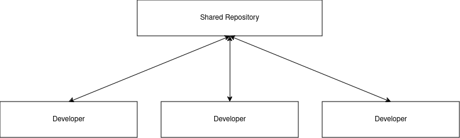

# Version Control
## What is version control?
Refers to a general concept of managing changes to files over time. It is the idea of organizing, controlling and keeping track of different versions in history of computer files, primarily source code text files, but generally any type of file, allowing one to revert to a previous state if necessary.
## What is a version control system?
These are software that helps track changes made to files over time. It allows you to create different versions of files, revert to previous versions if needed, and collaborate effectively with others on projects. 
Its keeps track of every modification to the files in a special kind of a database where one can look at the project history and see:
<ol type='i'>
	<li> who has made the changes </li>
	<li> when the changes were made </li>
	<li> why the changes were made </li>
	<li> can also revert back to an initial state of the code </li>
</ol>
As a developer edits code, the version control system takes a snapshot of the files. It then saves that snapshot permanently so it can be recalled later if needed.
Without version control system, developers are tempted to keep multiple copies of their code on their computer. This is dangerous because it's easy to change or delete a file with the wrong copy/version of code, potentially losing work. This also makes the entire process very slow and not scalable especially if multiple people have to work on the same project.
As a result, developers will have to toss around the latest code via email or other mechanisms and then merge the changes. Version control solves this problem by managing all versions of the code but presenting the team with a single version at a time.

A good version control system:
1. Supports a developer's preferred workflow without imposing one particular way of working
2. Works on any platform, rather than dictate what operating system or tool chain developers must use
3. facilitate a smooth and continuous flow of changes to the code rather than the frustrating and clumpsy mechanism of file locking - giving the green-light to one developer at the expense of blocking the progress of others

## Key concepts
Essential to understanding how version control systems actually work.
### 1. Repository (repo)
This is where all the project files and history of changes are stored. It acts a special type of database for the project files and its version history.

**Types**
1. **Local Repository** - Stored on your computer
2. **Remote Repository** - Stored on a server (e.g., GitHub, GitLab, BitBucket) 
### 2. **Commit**
Refers to a snapshot of your project at a specific point in time. Each commit represents a recorded change to your project, with a message describing what was done.

**Commit Message**: A description of the changes made, which should be clear and concise.\

### 3. Branch
A **branch** allows you to work on different versions or features of your project in parallel without affecting the main code base (often called the `main` or `master` branch)

**Example**: Can create a branch for a new feature or bug fix, test your changes, and later merge them into the main project.

### 4. Merge
**Merging** integrates the changes from one branch into another. Often done when one feature is complete and ready to be combined with the main project.

**Merge Conflict**: Happens when changes in two branches are incompatible. These conflicts need to be resolved manually.

### 5. Pull Request (PR) or Merge Request (MR)
A pull request is a request to merge changes from one branch into another, usually after code reviews and approvals in collaborative environments.

It facilitates collaboration by allowing others to review and discuss changes before they are integrated.

### 6. Staging Area (Index)
The **staging** are is where changes are prepared before making a commit. You can add specific changes to the staging area (using `git add` in Git), allowing you to commit only parts of your changes.

### 7. Checkout
**Checking out** a commit or a branch means switching your work directly to match the specified commit or branch, allowing you to view or modify that version of the project.

### 8. Tag
A **tag** is a label that marks a specific commit as important, often used for releases (e.g., `v1.0.0`). Tags make it easier to find and reference particular versions of your project.

### 9. Fork 
A **fork** is a copy of a repository that allows you to experiment and work independently of the original project. Commonly used in open-source projects where contributors fork a repo to make changes before proposing them back.

### 10. Revert
**Reverting** means undoing changes by creating a new commit that undoes the effect of previous commits, without altering the commit history.

### 11. Reset
**Resetting** allows you to move the pointer of a branch backward in time to an earlier commit, effectively removing changes from the history. It can be **more destructive** that revert, as it can erase changes.

### 12. Clone
**Cloning** a repository means copying it from a remote server (like GitHub) to your local machine. It gives you access to the full project history and all its files

### 13. Conflict
A **conflict** occurs when two changes in different branches cannot be automatically merged because they affect the same lines of code. 

### 14. Blame
**Blame** is a command (e.g., `git blame`) that shows who made the last modification to each line of a file, useful for tracking responsibility for changes.

### 15. Diff
A **diff** shows the difference between two commits or branches, highlighting what has been added, modified, or deleted. This helps in reviewing changes.

### 16. Push/Pull
**Push**: Sending your local changes to the remote repository (e.g., pushing commits from your machine to GitHub).

**Pull**: Fetching changes from the remote repository to your local machine and applying them to your current branch.

### 17. Remote
A **remote** is a pointer to a version of your repository hosted elsewhere, usually on a server. It allows multiple people to collaborate on the same project.

## Why is Version Control Important 
### Importance of Version Control
* Focuses on **why** version control is critical and essential in development and collaboration
* Refers to the role version control plays in ensuring a project's integrity, collaboration, and overall success. 
* It emphasizes the **need** for version control in handling projects and ensuring smooth workflows.
#### Key points on importance
- **Maintaining a record of changes**: It's important to know what was changed, when, and why for transparency.
- **Collaboration**: In large teams, version control becomes vital to avoid conflicts, overwriting, and loss of work.
- **Backup and recovery**: It’s essential for protecting work, allowing teams to recover from mistakes or issues.
- **Support for parallel development**: Working on multiple features or versions simultaneously is crucial in fast-moving projects.

**Example**: Without version control, it would be nearly impossible to manage large software projects with multiple contributors, track issues, or recover from errors.
### Benefits of version control
* Focuses on **what advantages** version control provides once it's in place.
* These are the tangible and measurable outcomes that teams experience from using a version control system.
* Emphasizes the **improvements** and **efficiency gains** that come from adopting version control.
#### Key Benefits
- **Collaboration and conflict resolution**: Multiple people can work together efficiently without overwriting each other’s work.
- **Tracking changes**: The ability to see the history of changes helps with accountability and understanding a project’s evolution.
- **Backup and safety**: It ensures that you never lose work because previous versions are stored and easily recoverable.
- **Experimentation and isolation**: Developers can create branches to experiment without affecting the main project.
- **Integration with CI/CD**: Version control can trigger automated processes for testing, building, and deploying projects.

**Example**: With version control, developers can collaborate across time zones, review each other's work, and experiment with new ideas while keeping the main codebase stable and clean.

## Types of Version Control Systems
### 1. Local Version Control Systems 
Many people's version control method of choice is to copy files into another directory(*perhaps a time-shaped directory if they're clever*). This approach is very common because it is so simple, but it is also incredibly error prone. Very easy to forget which directory you're in and accidentally write to the wrong file or copy over files you don't mean to. To deal with this issue, programmers developed local VCSs that had  a simple database that kept all changes to files under version control.

`Figure 1. local version control diagram`

#### Pros
* Fast access to history since it's stored locally
* Simple to set up and use

#### Cons
* Limited collaboration capabilities
* Risk of data loss if the local machine fails

One of the most popular VCS tools was **RCS**(*Revision control system*):- Works by keeping patch sets(*difference between files*) in a special format disk. It can then re-create what any file looked like at any point in time by adding up all the patches.

### 2. Centralized Version Control System
The next major issue encountered is the need to **collaborate** with other developers on other systems, and to deal with this problems, Centralized Version Control System were developed. These systems (*e.g., Concurrent Version System, Subversion, and Perforce*) have a single server that contains all the versioned files, and a number of clients that check out files from that central place.  

Has been the standard for version control for many years

`Figure 2. Centralized version contol diagram`

#### Pros
* Easier to manage access and permissions.
* Simplified Collaboration with a single source of truth

#### Cons 
* Single point of failure
	* if the central server goes down, no one can collaborate
	* If the hard-disk in the central database is corrupted and proper backups haven't been kept, you lose absolutely everything - the entire history of the project except whatever single snapshots people happen to have on their local machines
* Limited offline capabilities; Users need internet access to commit changes.
### 3. Distributed Version Control System 
In DVCSs(*e.g., Git, Mercurial or Darcs*) clients don't just checkout the latest snapshot of the files; rather, they fully mirror the repository, including its full history.

If any server dies, and these systems were collaborating via that server, any of the clients repositories can be copied back up to the server to restore it.

Every clone is a full back up of all the data.

`Figure 3. Distributed version control system`

Many of these systems deal pretty well having several remote repositories they can work with, and you can collaborate with different groups of people in different ways simultaneously within the same project.

#### Pros
* Full history available locally, enabling offline work
* Facilitates branching and merging enhancing collaboration
* Allows for distributed workflows, making it easier to work on multiple features simultaneously

#### Cons
* More complex set up and workflows compared to CVCSs
* Users must mange synchronization with the central repository.
